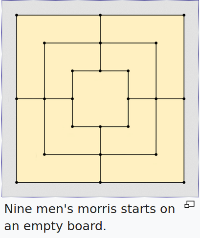
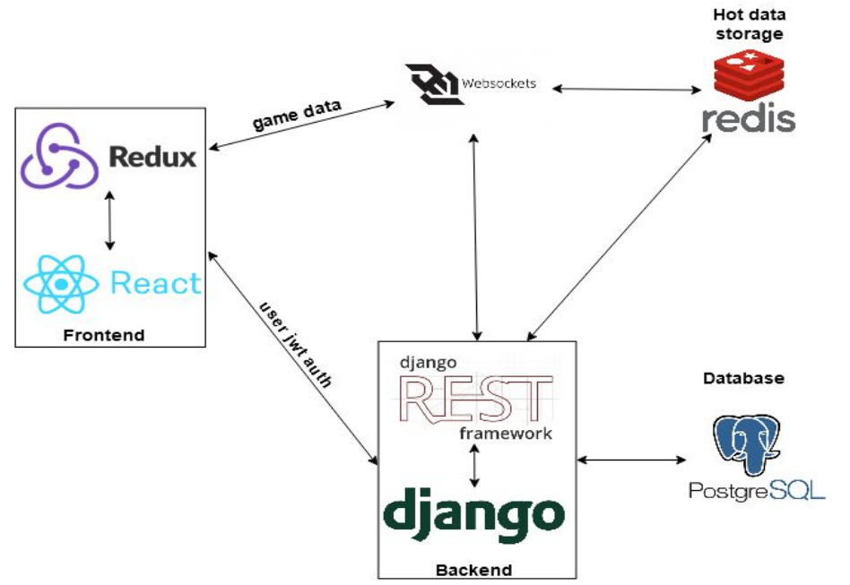

# Thesis Subject: *"A web application with AI bot for Νine Μen's Μorris board game"*

The project's code is in the [web_app_edition folder](https://github.com/JohnPapad/Thesis/tree/master/web_app_edition).  
A [terminal edition](https://github.com/JohnPapad/Thesis/tree/master/terminal_edition) (does not contain online PvP mode) is also included.

### Table of Contents

[Abstract](#abstract)

[Project Summary](#summary)

[The Game](#gameInfo)

[Contributors](#contributors)

[The Stack](#stack)

[Tools Used](#tools)

[How to install](#install)

[How to run](#run)


<a name="abstract"/>

# Abstract

The purpose of this project is to implement a web application with GUI (Graphical User
Interface) for Nine Men's Morris board game. The user can play in real time, remotely,
against either other users or an AI bot, running on the server side. Additionally, it aims in
studying the minimax decision-making algorithm with an optimization technique, called
Alpha-Beta Pruning, and finding efficient heuristic functions, for the purpose of
implementing the aforementioned AI bot.
The procedure followed, started with the in-depth understanding of the game rules and its
restrictions. Thereafter, the game’s basic logic and its necessary mechanisms
(moving-removing pieces, changing players’ turn, win-lose conditions etc) was
implemented in the python programming language and tested in terminal, without GUI. In
this context, the AI bot was coded and tested for its performance. Afterwards, the web
app’s user interface (front-end) was build using the React JS Library and the server side
(back-end) using the Django Web Framework, integrating the already developed python
code. Finally, the messages’ structure, used by the communication protocols (REST API,
WebSocket), was determined and communication between front and back end was
enabled.
The end result is a user friendly application that works seamlessly on every device
(smartphones, laptops, PCs etc). Players can search for an opponent through the
matchmaking feature. The AI bot performs at a good level, that can win against
experienced players.


<a name="summary"/>

# Project Summary

Nine Men’s Morris Online is a web application for playing the Nine Men’s Morris board
game either against another player or a AI bot, that uses a decision making algorithm. The
overall application is composed of 2 distinguished apps: the front and the back end. The
back-end is developed with python, using the Django Web Framework and the front-end is
developed with JSX and CSS, using the React JS Library. The back-end runs on WSGI
server, whereas the front-end runs on nodeJS server. Due to the RESTful architecture the
2 apps are completely independent from one another, and can be served from different
domains, if desired. They can be also developed, maintained and expanded separately
and even replaced with other web/JS frameworks, such as Spring and Vue JS
respectively; as long as the communication messages’ JSON structure remains the same.
The AI algorithm, is encapsulated in the back-end. PostgreSQL database was used for
normal data storage (e.g users’ info). However, this kind of database would not be efficient
enough for multiple retrieves and insertions, needed during multiple game sessions.
Therefore, redis a in-memory data structure store, was chosen for this particular task.
Apart from standard HTTP requests (GET, PUT etc), a real time bi-directional
communication between front and back end, so that every game action (e.g. placing,
moving pieces) to being executed concurrently, was necessary. So, the websocket
protocol was chosen.


<a name="gameInfo"/>

# The Game

## Εtymology
Nine Men's Morris is a strategy board game for two players, believed to be one of the
oldest games in history. It is an alignment and configuration game that is found widely
around the world. Morris does not have to do with Morris dancers, instead it comes from
the Latin word “merellus”, meaning “the corruption of counters”. The game is also known
as nine-man morris, mill, mills, the mill game, merels, merrills, merelles, marelles,
morelles, and ninepenny marl in English. The game has also been called cowboy checkers
and is sometimes printed on the back of checkerboards. 

## Origin
The earliest known diagram of this game was found in an
Egyptian temple in Kurna Egypt, dating around 1440 BC.
Other boards have been discovered in the ancient Greek
city of Mycenae (c. 1300 BC), Ceylon of Sri Lanka (c. AD
10) and in the Gokstad Viking ship (c. AD 900). In Ceylon
two boards are cut on the steps leading to the hill at
Mihimtali and others are found on a rock near Lankarama
dagaba. Evidence of the board scratched in the ground
has also been found in the Bronze-Age Ireland, ancient
Troy, Roman Empire and the Southwestern United
States. In the US, Kere, Tigua, Tew and Zuni Indians
played a version of the game called paritariya, picarva,
and pedreria. To the ancient Celts, the Morris square was
sacred. The central square known as the Cauldron or Mill
was a symbol of regeneration while the lines and squares
coming out from the middle were symbols of "the four
cardinal directions, the four elements and the four winds".

## Rules

### General
The board consists of a grid with twenty-four intersections or ​ points ​ . Each player has nine
pieces, or "men", usually coloured black and white (in this project blue and yellow has
been used, respectively). Players try to form 'mills', three of their own men lined
horizontally or vertically, allowing a player to remove an opponent's man from the game. A
player wins by reducing the opponent to two pieces (where they could no longer form mills
and thus be unable to win), or by leaving them without a legal move.
The game proceeds in three phases:
1. Placing men on vacant points
2. Moving men to adjacent points
3. (*optional phase - not included in this project*) Moving men to any vacant point when
the player has been reduced to three men

### Phase 1: Placing pieces



The game begins with an empty board. The players determine
who plays first (in our case, randomly chosen by the
computer), then take turns placing their men one per play on
empty points. If a player is able to place three of their pieces
on contiguous points in a straight line, vertically or horizontally,
they have formed a mill and may remove one of their
opponent's pieces from the board and the game, with the
caveat that a piece in an opponent's mill can only be removed
if no other pieces are available. After all men have been
placed, phase two begins.


### Phase 2: Moving pieces

Players continue to alternate moves, this time moving a man to an adjacent point. A piece
may not "jump" another piece. Players continue to try to form mills and remove their
opponent's pieces as in phase one. A player can "break" a mill by moving one of his
pieces out of an existing mill, then moving it back to form the same mill a second time (or
any number of times), each time removing one of his opponent's men. The act of removing
an opponent's man is sometimes called "pounding" the opponent. When one player has
been reduced to three men, an optional phase 3 may follow. However, in the standard
version, the game remains in phase 2 and will end when one player is down to 2 men.

### Phase 3: "Flying" (*optional - not included in this project*)

When a player is reduced to three pieces, there is no longer a limitation on that player of
moving to only adjacent points: The player's men may "fly" (or "hop", or "jump") from any
point to any vacant point.
A 19th-century games manual calls this the "truly rustic mode of playing the game". Flying
was introduced to compensate when the weaker side is one man away from losing the
game.


<a name="contributors"/>

# Contributors

[Ioannis Papadopoulos](https://github.com/JohnPapad)

[Rafail Chatzidakis](https://github.com/RafaelChatz)

<a name="stack"/>

# The Stack




<a name="tools"/>


# Tools used

- **React JavaScript Library** (for front-end)
  
  - Router-dom (for routing)
  - reactstrap (for UI)
  - axios (for HTTP requests)
  - Redux (for state management)
  - Immer (for fast and easy state manipulation)
  - Sass (for UI styling)

- **Django REST Framework** (for API)
  - channels (for websockets)
  - CORS headers (to allows in-browser requests to the Django application from other origins)

- **PostgreSQL** (for data storage)
- **Redis** (for efficient data storage and retrieval during games)
- **Docker** (for easy installation and future deployment)


<a name="install"/>

# How to install

Docker and docker-compose must be installed.   
Follow the instructions from the [official docker site](https://docs.docker.com/install/).


<a name="run"/>

# How to run
From inside the "web_app_edition" folder:  
```docker-compose up --build```
